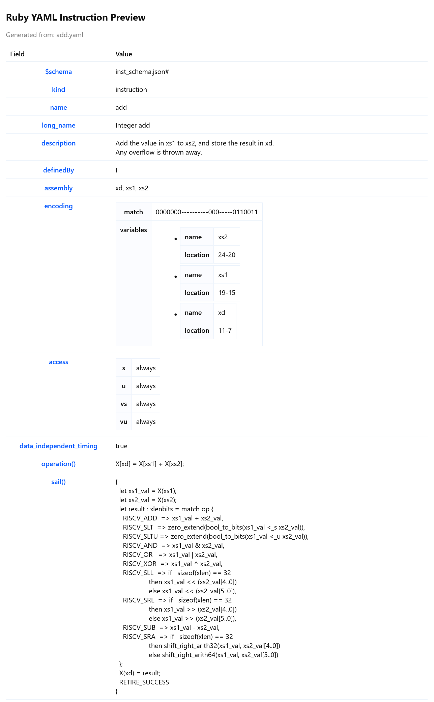

# Ruby Practice

My practice files and notes for learning and understanding Ruby.

Concepts:

<ol>
<li>Input & Output</li>
<li>Variables & Data Types</li>
<li>Arrays</li>
<li>Functions / Methods</li>
<li>Conditionals</li>
<li>Dictionary</li>
<li>Loops</li>
<li>Exceptions</li>
<li>Classes and Objects</li>
<li>Object Oriented Programming in Ruby</li>
</ol>

## YAML to HTML Generator

A Ruby script that converts a UDB YAML file into a formatted HTML table with fields and values.

```bash
ruby yaml-html-generator.rb add.yaml
```

